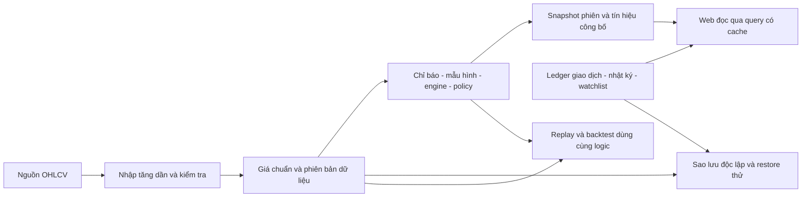

**Đánh giá UI/UX, logic phân tích và hệ thống dữ liệu Prot Stock**

Ngày đánh giá: 02/10/2026, múi giờ Việt Nam. Phạm vi: web app cá nhân, không thương mại, phân tích cuối ngày, ưu tiên chi phí dịch vụ bằng 0 trong hạn mức miễn phí.

**Kết luận chính**

Nên giữ nền tảng React/Vite + Python + PostgreSQL/Supabase hiện có. Không có bằng chứng cần viết lại toàn bộ frontend hay database. Giao diện đã có nền thẩm mỹ và nhiều cơ chế giải thích tốt; phần cần ưu tiên là bảo toàn dữ liệu cá nhân, độ đúng của backtest/báo cáo, tính bất biến của quy tắc và sự minh bạch về trạng thái dữ liệu.

Thứ tự phù hợp: sao lưu và kiểm thử khôi phục → sửa lỗi tính toán/ghi dữ liệu → thống nhất hợp đồng dữ liệu và trạng thái → cải tiến các luồng UX → hoàn thiện UI. Frontend và backend nên được sửa theo từng luồng hoàn chỉnh, chẳng hạn “nộp/rút vốn” gồm transaction phía server và phản hồi lưu phía giao diện.

**Phạm vi kiểm chứng và giới hạn**

- Đọc mã nguồn, migrations, cấu hình và workflows; không truy vấn hoặc thay đổi database production, không triển khai, không chạy ingestion thật.
- Frontend biên dịch thành công. 14 kiểm tra frontend và 199 kiểm tra Python hiện có đều thành công. Có thử nghiệm dữ liệu tổng hợp để tái hiện các lỗi backtest; các lỗi này chưa được bộ test hiện có bao phủ.
- Kiểm tra bản xem trước cục bộ không kết nối database: Dashboard sáng/tối ở 1440px, Dashboard ở 390px và 320px; sáu màn hình CLIENT ở 390px. Không thấy tràn ngang trong các trạng thái này và không thấy lỗi JavaScript ở lượt kiểm tra Dashboard/Command Palette.
- Các màn hình chứa bảng dữ liệu đầy đủ, quyền ADMIN, screen reader, Safari/iOS thật, Windows high contrast và hiệu năng production chưa được kiểm chứng trực tiếp. Đánh giá các phần đó dựa trên code, không phải chứng nhận tuân thủ.
- File `data/universe.csv` hiện có 265 mã khác nhau, trong khi README ghi 208. Số mã đang hoạt động trong database production chưa xác minh. Tài liệu cần lấy số liệu từ một nguồn chung.
- Không tìm thấy AGENTS.md áp dụng trong dự án. Không sửa mã nghiệp vụ trong quá trình đánh giá.

**1. UI/UX và đối chiếu thiết kế nền tảng**

Đây là web app đa nền tảng. Apple HIG và Microsoft Fluent là tài liệu định hướng; WCAG 2.2 là chuẩn phù hợp hơn để nghiệm thu khả năng truy cập web. Có blur, góc bo hoặc màu kính không đồng nghĩa với việc đạt chuẩn iOS/macOS/Windows.

Theo nguồn chính thức tại ngày đánh giá, macOS 27 có tên Golden Gate. iOS 27/macOS 27 tiếp tục tinh chỉnh Liquid Glass theo hướng dễ đọc và cho phép tùy chỉnh độ trong. Apple HIG đặt Liquid Glass chủ yếu ở lớp điều khiển/điều hướng, hạn chế dùng trong lớp nội dung. Không cần sao chép hiệu ứng kính native lên tất cả card của một ứng dụng đọc số liệu.

Nguồn: [Apple HIG — Materials](https://developer.apple.com/design/human-interface-guidelines/materials), [iOS 27 Updates](https://support.apple.com/en-gb/149076), [macOS 27 Golden Gate](https://support.apple.com/en-us/127257), [Microsoft Design Guidelines](https://learn.microsoft.com/en-us/windows/apps/design/guidelines-overview), [WCAG 2.2](https://www.w3.org/TR/WCAG22/).

**1a. Tổng thể, bố cục, font, màu, glass, khoảng cách và mật độ**

| Hạng mục | Hiện trạng có bằng chứng | Kết luận và hướng sửa |
|---|---|---|
| Nhận diện tổng thể | Inter, palette xanh trầm/lime, chế độ sáng/tối, icon Lucide, card và CTA thống nhất tương đối | Nền tốt, phù hợp công cụ cá nhân. Giữ nhận diện và giảm biến thể không cần thiết. |
| Bố cục desktop | Sidebar, tìm kiếm, ngày thị trường, KPI, ba nhóm Hành động/Chờ trigger/Bối cảnh | Phân cấp hợp lý ở Dashboard desktop. CTA “Mở bộ lọc” nổi bật và nội dung chuyên sâu có thể mở thêm. |
| Bố cục mobile | Sáu màn hình CLIENT không tràn ngang ở 390px trong trạng thái chưa có dữ liệu | Chưa chứng minh với dữ liệu đầy đủ. Dashboard đưa Watchlist/Data Health lên trước Decision Board tại `styles.css:1319`; nên ưu tiên dữ liệu phiên → việc cần xử lý → watchlist, vận hành đưa vào phần mở rộng. |
| Typography | Có token cỡ chữ, line-height và số thẳng cột; nhưng nhiều CSS hard-code 9–11px | Font phù hợp tiếng Việt và bảng tài chính. Đề xuất body 14–16px, thông tin quan trọng 14px trở lên, caption thường 12px trở lên; đây là mục tiêu thiết kế, không phải giới hạn font bắt buộc của WCAG. |
| Điều hướng mobile | Đo thực tế: nhãn 10px; mỗi mục rộng khoảng 57px ở 390px và 45,5px ở 320px | Mục bấm có bề ngang tương đối ổn nhưng nhãn nhỏ, dễ xuống dòng. Đề xuất 4–5 mục chính + Thêm; chuyển Giới thiệu vào Cài đặt. |
| Màu và tương phản | Token light `#172d23/#fff` khoảng 14,62:1; muted light `#4d6658/#fff` khoảng 6,26:1. Một cặp màu footer dark `#50665c/#07110e` chỉ khoảng 3,10:1 | Một số cặp tốt, nhưng chưa đạt toàn hệ thống. Footer thực tế dark vẫn dùng `#50665c` trên nền rất tối; cần tăng tương phản. Đo computed style từng thành phần, không chỉ token. |
| Độ sáng | Có theme theo hệ thống và lựa chọn được lưu | Điểm tốt. Bảng số liệu nên có surface ổn định, hạn chế glow và nền quá nhiều lớp; thử đọc lâu trên cả hai theme. |
| Glass | Blur ở backdrop/modal và watch-stock; mobile header/nav có override tắt blur cuối stylesheet | Không phải triển khai Liquid Glass native. Hạn chế kính ở nội dung chứa số liệu; dùng nền đặc khi tăng tương phản/giảm hiệu ứng. Không cần thêm shader/hiệu ứng khúc xạ cho nhu cầu cá nhân. |
| Khoảng trắng | Có scale 4/8/12/16/20/24/32px, card padding 18–22px và bo góc | Tương đối khoa học. Cần hợp nhất token vì nhiều lớp CSS cũ và `!important` ghi đè làm thay đổi khó dự đoán. |
| Mật độ | Dashboard desktop rõ, màn hình phân tích chứa nhiều lớp kỹ thuật, Watchlist có Roulette | Cho phép chế độ Gọn/Chi tiết; giữ thông tin ra quyết định trước, giải thích sau. Roulette nên là tùy chọn thu gọn. Không thêm nhiều KPI chỉ vì có dữ liệu. |
| Motion | Có xử lý reduced motion ở một số thành phần | Cần áp dụng xuyên suốt; hiện còn animation live-dot và một số transitions ngoài các phạm vi giảm chuyển động. |
| Zoom/reflow | `index.html:10` đặt `maximum-scale=1.0,user-scalable=no` | Bỏ hạn chế zoom. Kiểm tra phóng chữ 200%, reflow 320 CSS px và focus không bị thanh điều hướng che. Hành vi zoom có thể khác giữa các trình duyệt nên phải thử trên thiết bị thật. |

WCAG AA yêu cầu tương phản chữ thường ít nhất 4,5:1, chữ lớn 3:1. Target Size Minimum của WCAG 2.2 là 24×24 CSS px với các ngoại lệ; dùng khoảng 44×44px cho tác vụ chính trên điện thoại là mục tiêu thực dụng, không nên gọi 44px là yêu cầu AA chung. [Contrast Minimum](https://www.w3.org/WAI/WCAG22/Understanding/contrast-minimum.html), [Target Size Minimum](https://www.w3.org/WAI/WCAG22/Understanding/target-size-minimum.html), [Resize Text](https://www.w3.org/WAI/WCAG22/Understanding/resize-text.html).

**1b. Đánh giá năm nhóm UX**

| Tiêu chí | Đánh giá | Cải tiến cụ thể |
|---|---|---|
| Usefulness | Khá: từ thị trường/ngành → bộ lọc → phân tích mã → theo dõi → giao dịch/nhật ký là chuỗi phù hợp EOD | Ưu tiên câu hỏi “Hôm nay cần kiểm tra gì? Vì sao? Điều kiện nào làm nhận định mất hiệu lực?”. Kết quả backtest và báo cáo danh mục phải được sửa trước khi dùng làm căn cứ. |
| Usability | Đạt một phần: có Ctrl K, giải thích và phân nhóm; nhưng modal, lỗi trống, nút không hoạt động và nhiều thuật ngữ gây bối rối | Một CTA chính mỗi vùng; tên trạng thái tiếng Việt nhất quán; thao tác một lần bấm; lưu draft và phản hồi lưu rõ. |
| Findability & Accessibility | Đạt một phần: sidebar/mobile navigation/tìm mã tốt; nhưng command palette có route không được phép, label sidebar mất khi thu gọn, một số chi tiết chỉ double-click | Dùng chung danh sách route theo quyền; `aria-current`, tên truy cập cho icon, dialog/focus chuẩn, keyboard toàn luồng và dữ liệu thay thế cho chart. |
| Credibility | Chưa đủ: có ngày EOD, coverage, lý do tín hiệu và cảnh báo score không phải xác suất; nhưng AI template, trạng thái dữ liệu và thống kê có thể gây hiểu nhầm | Công khai ngày/nguồn/revision/phạm vi mẫu; phân biệt lỗi với không có dữ liệu; đổi nhãn AI; giữ rule version và snapshot quyết định. |
| Desirability | Khá về nhận diện và thẩm mỹ | Tăng cảm giác yên tâm bằng dữ liệu đúng, thao tác ổn định và thông báo rõ. Với ứng dụng tài chính cá nhân, giảm cảm giác trò chơi ở luồng nghiên cứu chính. |

**1c. Đánh giá năm nhóm UI**

| Tiêu chí | Kết luận | Hành động |
|---|---|---|
| Consistency | Có design token nhưng CSS nhiều lớp, tên Cài đặt/Giới thiệu và quyền điều hướng chưa nhất quán | Hợp nhất token và component Input/Button/Table/Dialog/Status; một glossary cho action, flow, score và trạng thái. |
| Visual Hierarchy | Desktop khá; mobile đưa phần vận hành lên trước hành động | Giữ thứ tự việc quan trọng trên mọi kích thước. Mỗi tín hiệu: mã, hành động, ngày, trigger/stop, lý do; chi tiết kỹ thuật mở thêm. |
| Color & Contrast | Một số cặp màu tốt; còn chữ nhỏ/mờ và chưa kiểm tra đủ hai theme | Đo computed colors; tăng muted; luôn có nhãn/icon đi kèm màu; kiểm tra high contrast. |
| Whitespace | Có nhịp khoảng cách tốt nhưng không đồng bộ toàn bộ màn hình | Dùng spacing scale chung; dữ liệu dạng bảng dùng hàng compact có thể lựa chọn, tránh card lớn cho mỗi con số. |
| Feedback | Loading/skeleton/status đã có; mutation và error chưa đầy đủ | Mọi lưu/xóa/chạy job phải có pending/success/error, chặn gửi lặp, Retry/Undo phù hợp và giữ nội dung nhập khi lỗi. |

**1d. Mười nguyên tắc Nielsen**

Đây là đánh giá chuyên gia theo heuristics, không thay thế thử nghiệm người dùng. Khung tham chiếu: [Nielsen — 10 Usability Heuristics](https://www.nngroup.com/articles/ten-usability-heuristics/).

| Nguyên tắc | Mức hiện tại | Bằng chứng và việc sửa |
|---|---|---|
| 1. Hiển thị trạng thái hệ thống | Đạt một phần | Data Health/skeleton tốt; Dashboard query error có thể thành “Chưa có hành động mới”. Khi chưa kết nối, TodayHealth hiển thị 0/0 và vẫn kết luận đã đủ độ phủ (`TodayHealth.tsx:51–60`). Tách chưa kết nối/đang tải/lỗi/rỗng/thiếu/cũ/đủ. |
| 2. Phù hợp thế giới thực | Đạt một phần | Có tiếng Việt và ngày giao dịch; còn raw WATCH/UPTREND/Core/reason code và lỗi “schema Phase 4”. Dùng ngôn ngữ nhiệm vụ, đưa chi tiết kỹ thuật vào phần mở rộng. |
| 3. Quyền kiểm soát và tự do | Chưa đủ | Mobile không có đăng xuất; đóng sheet có thể mất draft; thiếu undo gỡ mã. Bổ sung menu tài khoản, đóng bằng Escape/nút, giữ draft và Undo. |
| 4. Nhất quán và tiêu chuẩn | Đạt một phần | Token tốt nhưng palette đưa CLIENT vào route bị chặn rồi quay về Tổng quan. Dùng cùng registry route/phân quyền cho mọi cách điều hướng. |
| 5. Phòng ngừa lỗi | Chưa đủ | Backtest ngầm chọn rule đầu dù dropdown trống, cho gửi lặp; parser bỏ điều kiện chưa hiểu. Bắt buộc chọn rõ, validate và preview đầy đủ. |
| 6. Nhận biết thay vì ghi nhớ | Khá | “Vì sao?”, evidence, guide, Tier và nhóm tín hiệu hỗ trợ đọc. Cần tooltip định nghĩa ngắn ngay nơi dùng, có ví dụ trigger/invalidation. |
| 7. Linh hoạt và hiệu quả | Khá nhưng cần tối ưu | Ctrl K, filter, export và gộp mã hữu ích. Query lịch sử toàn bộ mỗi phút làm giảm hiệu quả lâu dài; phân trang/filter server và cache theo publication. |
| 8. Thẩm mỹ và tối giản | Đạt một phần | Dashboard rõ nhưng mobile ưu tiên vận hành; Roulette và AI template thêm nhiễu. Thu gọn nội dung phụ và đưa hành động lên trước. |
| 9. Nhận biết, chẩn đoán, phục hồi lỗi | Chưa đủ | Một số lỗi bị trình bày như không có dữ liệu; insert backtest bỏ qua error. Thông báo tác động + thao tác phục hồi + giữ dữ liệu nhập. |
| 10. Trợ giúp và tài liệu | Khá | EngineGuide và hướng dẫn nhiều khung tốt; lịch vận hành và số mã bị lỗi thời. Đồng bộ tài liệu với cấu hình và phiên bản thật. |

**Các lỗi UX cụ thể đáng sửa**

- `CommandPalette.tsx:21–24`: “Trợ lý phân tích AI” chỉ trả khung Monthly/Weekly/Daily cố định, không truy vấn EOD hoặc mô hình AI. Bản cục bộ đã tái hiện với “Giải thích FPT hôm nay”. Đổi thành “Hướng dẫn đọc tín hiệu” hoặc tạo giải thích dựa trên dữ liệu bằng quy tắc xác định; không cần API AI trả phí.
- `App.tsx:56`: chuông thông báo có chấm báo nhưng không có hành vi click. `AnalysisPage.tsx:78`: nút tùy chỉnh chart cũng chưa có hành vi. Bỏ hoặc hoàn thiện.
- `App.tsx:55`, `styles.css:321`: chỉ sidebar có đăng xuất, mobile ẩn sidebar. Thêm đăng xuất trong menu tài khoản.
- Sidebar thu gọn/tablet ẩn label mà thiếu `aria-label`; bảng screener có hành vi double-click trên phần tử không tương tác (`ScreenerPage.tsx:91`). Dùng link/button hoạt động bằng bàn phím.
- Dialog danh mục/nhật ký thiếu semantics và quản lý focus; command dialog có Escape/autofocus nhưng chưa trap/restore focus. SoftSelect cần tên trường qua label/aria-labelledby thay vì chỉ đọc option đã chọn.
- Main QueryClient tồn tại ngoài AuthGate; query dữ liệu cá nhân không gắn user_id và sign-out không clear cache. RLS ở DB không tự xóa cache ở trình duyệt; có rủi ro hiển thị dữ liệu tài khoản trước trong lúc refetch.

**2. Logic và thiết kế theo từng phân hệ**

Quy ước: P1 = có thể làm kết quả sai, dữ liệu lệch/mất hoặc tính năng trọng yếu không chạy; P2 = giảm tính minh bạch, khả năng dùng hoặc hiệu năng; P3 = cải tiến thẩm mỹ/bảo trì. Đây là mức ưu tiên sửa, không phải xác suất sự cố hay chứng nhận bảo mật.

| Phân hệ | Điểm đã làm tốt | Vấn đề cần xử lý và tiêu chuẩn nghiệm thu |
|---|---|---|
| Schema | PK/unique, CHECK OHLCV, FK, enum, index, RLS; có revision/algorithm version | Giữ cấu trúc chính. Bất biến rule version; thống nhất đơn vị giá/ngày/nguồn; ledger atomic; quy định retention và không xóa lịch sử cá nhân khi mã rời universe. |
| Mẫu hình | Pivot xác nhận, FORMING/READY/CONFIRMED, trigger/invalidation, quality components và dedup | Có nền logic giải thích được. Cần dữ liệu có nhãn, false positive/negative theo pattern/timeframe và kiểm tra as-of. Quality score là điểm cấu trúc, không phải tỷ lệ thắng. |
| Core Engine | Registry và policy chung; ưu tiên EXIT/REDUCE, kiểm dữ liệu cũ, bối cảnh, thanh khoản và rủi ro | EOD/live và backtest hiện đi hai đường khác nhau. Cùng bars/context/position/rule version phải cho cùng hành động trước bước khớp lệnh. |
| Core Pack | Bật/tắt, phiên bản, notification mode; pack bối cảnh; evidence cluster giảm đồng thuận trùng | Phân biệt setup/xác nhận/bối cảnh/chặn rủi ro. Điểm confluence 70/90/98 là quy ước, không diễn giải là xác suất. |
| Rules | DSL giới hạn, có preview/hash, không chạy code tùy ý | P1 phiên bản bị ghi đè; P2 parser bỏ điều kiện và cắt lỗ chưa có metric. Parser phải báo phần không hiểu, lưu DRAFT; thay đổi tạo version/hash mới. |
| MACD | EMA12/26 và Signal9 dùng SMA seed; có phân kỳ/pivot xác nhận | Python và TypeScript tính độc lập, cutoff/lookback khác. Chưa chứng minh số lệch, nhưng cần test parity trên cùng bars/seed/cutoff. Backend làm nguồn quyết định, frontend dùng để vẽ. |
| Market Health | SMA20/50/200, MA stack, A/D, depth, coverage và guard | Đo trên universe Prot. Thiếu SMA200 hiện ảnh hưởng score như không đạt điều kiện; cần công khai mẫu số từng chỉ báo hoặc UNKNOWN. Thay đổi cách tính phải version hóa và so sánh trước/sau. |
| Prot Flow | OHLCV proxy miễn phí, tách trạng thái phiên với CMF/OBV, UI có cảnh báo ý nghĩa | Tên dễ khiến hiểu là tiền thực. Ghi “áp lực giá–khối lượng”; không nhận diện dòng tiền tổ chức/nhà đầu tư và không phải net inflow. Trọng số/ngưỡng cần kiểm nghiệm lịch sử. |
| Sức khỏe ngành | Tái dùng health formula, sample và coverage | Ngành ít mã dễ biến động. Áp sample floor, hiển thị cỡ mẫu; lịch sử dùng tập mã/nhãn ngành hiện tại cần ghi rõ hoặc dùng membership theo thời điểm. |
| Sector Flow | Median giảm outlier; count và turnover share | Giải thích median trọng số đều và tỷ trọng giá trị giao dịch là hai đại lượng khác nhau; không gọi là lượng tiền vào/ra ròng thực tế. |
| Bộ lọc tín hiệu | Gộp khung theo mã, reasons, filter, export, cảnh báo dữ liệu đối chiếu | Query lịch sử toàn bộ và filter client; chuyển filter/sort/pagination xuống server. Không lấy quá giới hạn rồi dùng tập bị cắt để tính tổng/xếp hạng. |
| Phân tích mã | Giá/chart, nhiều khung, cảnh báo nến chưa đóng, điểm mẫu hình và Flow có giới hạn rõ | Một bảng phụ lỗi có thể làm toàn truy vấn thất bại. Giá/chart chính phải vẫn dùng được khi fundamentals/disclosures lỗi; báo rõ phần thiếu và thời điểm dữ liệu. |
| Danh mục | Workflow giao dịch và RPC tính lại vị thế là nền tốt | P1 NAV quá khứ dựng từ vị thế hiện tại, capital movement hai request rời. Replay ledger theo ngày hoặc daily NAV snapshot; atomic RPC + idempotency; định nghĩa P&L/TWR rõ. |
| Nhật ký | Ghi quyết định/cảm xúc và có review | P1 đối chiếu lịch sử với tín hiệu mới nhất; nhiều khung collapse tùy dòng. Lưu signal/timeframe/revision tại ngày quyết định. Đồ thị compound từng trade không được gọi là NAV danh mục. |
| Watchlist | Tier S/A/B, đồng bộ cloud, migration local, Roulette lấy mẫu đều | P1 pending edits chỉ ở RAM, reload có thể bị cloud ghi đè. Outbox bền theo user, merge/replay, trạng thái chưa đồng bộ và Undo gỡ mã. |
| Backtest | Ý tưởng next-open, phí/thuế/slippage, worker, assumptions | P1 sai dispatcher, đơn vị và ngày equity; P2 warm-up/action/pattern/annualization. Không dùng kết quả hiện tại để xếp hạng chiến lược cho đến khi sửa. |
| Kiểm thử | CI build + frontend tests + Python tests | Unit tests tốt nhưng thiếu parity, kế toán danh mục, đơn vị, point-in-time, lỗi mạng và restore. Bổ sung các ca tái hiện lỗi thay vì chỉ tăng số lượng test. |
| Cài đặt | Có hướng dẫn và công cụ vận hành | Chưa đúng vai trò cài đặt cá nhân; cần theme/mật độ/tài khoản/export/trạng thái backup. Cập nhật giờ EOD và số mã; đưa công cụ quản trị vào phần riêng. |
| Dashboard | Hành động/Chờ trigger/Bối cảnh có ý nghĩa | Tách error/empty/disabled; chỉ tuyên bố đầy đủ khi có publication hợp lệ và mẫu số >0. Mobile ưu tiên hành động trước vận hành. |

**Các lỗi logic đã tái hiện hoặc có đường thực thi rõ**

| Mức | Phát hiện | Bằng chứng | Hướng sửa |
|---|---|---|---|
| P1 | Core backtest có thể mua dù không có setup | `pipeline/protstock/backtest.py:54` gọi evaluate_rule; Core DSL không có `all`; `rules.py:69` cho `all([])=True`. Thử nghiệm tổng hợp đã sinh trade | Dispatcher dùng chung với engines, từ chối DSL sai loại/điều kiện rỗng; action WATCH/EXIT/REDUCE và patterns/context phải được xử lý đúng. |
| P1 | Equity ghi lệch phiên | Mua ở open T+1 rồi ghi quantity đó vào equity ngày T (`backtest.py:56–62`). Repro vốn 1.000, giá T đóng 10, mua/bán 20, return 0 nhưng equity T=500 và Sharpe khoảng 15,87 | Tách close T → pending order → open T+1 fill → close T+1 mark-to-market; có equity đầu kỳ. |
| P1 | Số lượng trade sai đơn vị 1.000 lần | Giá canonical nghìn VND nhưng vốn là VND; `backtest.py:57` chưa nhân 1.000. Repro 100 triệu/giá 20 sinh 5 triệu CP thay vì 5.000 trước phí | Contract price_unit/currency; chuyển đơn vị tại biên tính tiền; kiểm tra lot size, phí và khả năng vốn. |
| P1 | Rule version có thể thay đổi sau khi được tham chiếu | `RuleBuilderPage.tsx:286` UPDATE DSL cũ và giữ hash; migration phase3 cho UPDATE | Version append-only; đổi cấu hình tạo phiên bản mới; snapshot DSL/hash/assumptions/data revision lúc queue. |
| P2 | Parser âm thầm bỏ điều kiện | “Vượt đỉnh 20 phiên và ROE >15%” chỉ giữ breakout; regex frontend/backend khác | Grammar/schema chung; unknown clause là lỗi hoặc nháp; hiển thị điều kiện đã hiểu/chưa hiểu trước kích hoạt. |
| P2 | Cắt lỗ tự viết chưa chạy đúng | `rules.py:37` tạo return_from_entry nhưng evaluator chưa tính từ context/position | Tách entry/exit/risk và tính metric vị thế. Policy stop_price hiện có là cơ chế khác, không chứng minh rule này đúng. |
| P2 | Warm-up và khung thời gian backtest thiếu | `backtest_worker.py:21` cắt date_from trước indicator; W/M chưa loại nến incomplete; annualize252 cố định | Giữ lịch sử trước kỳ để warm-up, chỉ trade trong kỳ; chỉ nến hoàn tất; annualization theo khung/elapsed time đã định nghĩa. |

Không suy ra hiệu quả đầu tư, xác suất thắng hay chất lượng dự báo từ việc code chạy hoặc tests pass. Những điều đó cần nghiên cứu trên dữ liệu lịch sử đủ sạch, out-of-sample và giả định khớp lệnh phù hợp.

**3. Database, lấy dữ liệu, vận hành hàng ngày và backup**

**3a. Nền tảng hiện tại**

Các lựa chọn chính hợp lý: Postgres lưu dữ liệu chuẩn; giá ngày dẫn xuất tuần/tháng có cờ hoàn tất; upsert/unique chống trùng; REST client tái sử dụng kết nối; các truy vấn độc lập có Promise.all; job logs theo mã và signal revisions phục vụ truy vết. Không cần thêm Redis, microservices hay realtime streaming cho EOD cá nhân.

Tuy nhiên, cần tách năm khái niệm: đã ghi giá, đã tính snapshot, đã tổng hợp thị trường, đã công bố tín hiệu, đã sao lưu. Một job SUCCEEDED không tự chứng minh mọi mã đủ dữ liệu hoặc bản backup có thể khôi phục.

**3b. Những khoảng thiếu vận hành**

| Mức | Phát hiện | Bằng chứng/giới hạn | Hướng sửa |
|---|---|---|---|
| P1 | Fallback KBS/VCI vẫn cùng một endpoint | `provider_vnstock.py:16–17,24–25,50`, `eod.py:59–61` | Adapter nguồn độc lập thật và kiểm tra provenance; nếu chỉ có KBS thì công bố đúng một nguồn. |
| P1 | Published partial có thể được coi COMPLETE | `eod_status.py:11–17`, `eod-fast.yml:106`, `eod.py:291–298,352` | PUBLISHED_PARTIAL khác COMPLETE; kiểm coverage/date/revision, retry missing-only. |
| P1 | RUNNING treo có thể khóa retry | `eod_status.py:22–23` không xét tuổi job | Heartbeat/timeout; STALE/FAILED và quy tắc phục hồi. |
| P1 | Chưa có backup/restore trong repo | Không thấy dump/restore workflow/script; chưa biết có backup ngoài repo hay không | Tạo backup độc lập, mã hóa, lịch retention và restore drill trước khi coi là an toàn. |
| P1 | Migration purge xóa lịch sử cá nhân | `20261001030000_curate_universe_and_purge_retired.sql:5–38` xóa journal/positions/transactions/backtests/revisions/prices của 7 mã | Comment ghi đây là quyết định Prot ngày 01/10, không kết luận trái phép. Chính sách tương lai: inactive/archive và giữ ledger; backup trước destructive migration. |
| P1/P2 | Queue backtest có thể chờ không được xử lý tự động | Scheduled eod-fast không gọi worker; eod.yml/eod-backfill.yml gọi worker nhưng manual | Worker nhẹ có lock/claim/timeout, phản hồi queue/status/error. |
| P2 | Lịch trên UI khác lịch code | Settings ghi 16:15/16:20/16:50; Fast Lane cron 15:30, watchdog migration mới 15:35 | Một nguồn lịch chung; phân biệt giờ bắt đầu và thời gian hoàn tất thực tế. Chưa xác minh cron nào thực sự deployed. |
| P2 | Giới hạn dòng có thể cắt dữ liệu | Repo config max_rows1000; có query limit3000/5000 không pagination | Cursor/range paging; server aggregates; UI công khai phạm vi báo cáo. Production limit chưa xác minh. |
| P2 | Corporate actions/adjusted prices chưa đủ bằng chứng | Schema có trường/bảng nhưng pipeline chính ghi OHLCV; chưa thấy luồng cập nhật đầy đủ | Kiểm tra chia tách/quyền/cổ tức bằng mã cụ thể; tách raw/adjusted, version và rebuild chỉ phần phụ thuộc. |

**3c. Tốc độ lấy dữ liệu và xử lý**

Các điểm tối ưu cần đo trước/sau:

- Screener lịch sử phân trang tải toàn bộ rồi filter/sort ở browser và tải lại mỗi 60 giây (`ScreenerPage.tsx:28–41,49,59`). Lọc theo ngày/mã/action/timeframe/score ở server, có thứ tự ổn định và pagination. Export toàn bộ là thao tác riêng.
- Dữ liệu EOD không đổi mỗi phút trong ngày. Cache theo publication date/source_revision; cache 5–15 phút cho dữ liệu tĩnh, refresh khi có publication mới hoặc người dùng yêu cầu. Dùng shared publication query để giảm đọc lặp.
- Analysis đang tải tới 2.600 phiên và nhiều bảng phụ. Có thể tải 300–500 phiên cho chart ban đầu rồi bổ sung, nhưng phải giữ đủ lookback cho engine và chỉ báo; không cắt dữ liệu tính toán tùy tiện.
- `eod.py:48` nghỉ 6,5 giây/mã. Riêng shard 104 mã tốn khoảng 11,3 phút nghỉ, chưa gồm mạng/tính toán. Shard thứ hai lấy phần còn lại bằng offset104/limit1000; thời gian phụ thuộc số mã active trong DB. Giảm delay chỉ sau khi đo giới hạn nguồn và có retry/backoff, không gửi ồ ạt.
- EOD đọc lịch sử ở ingestion rồi đọc/tính lại khi finalize; upsert toàn bộ W/M mỗi ngày. Tái sử dụng kết quả theo run_id/input_hash, batch RPC và chỉ ghi period thay đổi cùng các phụ thuộc cần rebuild.
- Generic REST upsert chưa có retry/backoff đủ rộng cho429/5xx/timeouts. Dùng retry có giới hạn, jitter và idempotency; thao tác tiền/giao dịch cần request ID và transaction.
- Build tạo main chunk khoảng510,87kB minified/148,34kB gzip, CSS khoảng167,80kB/31,34kB gzip. Đã lazy-load page, nhưng còn dư địa tải thư viện export/chart khi cần và gom CSS. Đây là chỉ số build, không phải thời gian mở trang production.
- Service worker bắt mọi GET và khi lỗi có thể trả cached HTML `/` cho request API (`public/sw.js:18–21`). Chỉ fallback HTML cho navigation; API phải trả lỗi đúng loại và dữ liệu cache có ngày/revision rõ. Không cần đầu tư offline đầy đủ nếu chỉ dùng online.

Trước khi thêm index, dùng query thực và EXPLAIN ANALYZE để xác định index thiếu. Không suy đoán tốc độ chỉ từ schema. Các trường lọc thường xuyên cần index theo pattern truy vấn, ví dụ symbol/timeframe/date/revision; tránh index chồng chéo khiến ghi và dung lượng tăng.

**3d. Báo cáo và thống kê**

- Danh mục: daily NAV = tiền mặt đúng ngày + giá trị số lượng nắm giữ đúng ngày. Nộp/rút là dòng vốn, không phải lợi nhuận. Tách absolute P&L, tỷ suất theo vốn và TWR/XIRR nếu thực sự cần; công khai công thức.
- Nhật ký: lưu ngày quyết định, khung thời gian, signal/revision, rule version, lý do, planned trigger/stop và liên kết trade/outcome. Đánh giá quyết định dựa trên thông tin khi ra quyết định.
- Báo cáo tín hiệu: số mã khác với số tín hiệu/khung; ghi coverage, phiên dữ liệu, universe version và filter đang áp dụng.
- Thống kê tổng chạy trên toàn tập ở server. Chi tiết có pagination. Không dùng100 journal hoặc1.000 transactions tải về để trình bày như thống kê toàn bộ mà không ghi phạm vi.
- Xuất CSV/XLSX/PDF phải có bộ lọc, ngày tạo, as-of date, đơn vị giá/tiền và phiên bản công thức. Export báo cáo không thay thế full database backup.

**3e. Sao lưu và khôi phục miễn phí**

Không thể đảm bảo tuyệt đối “không mất dữ liệu” chỉ bằng backup hàng ngày. Có thể xây dựng khả năng phát hiện lỗi, giảm khoảng dữ liệu có thể mất và chứng minh khôi phục được.

Phương án ban đầu:

1. Dump database sau EOD thành công và trước migrations có tác động xóa/chuyển đổi; lưu schema, data và thông tin cấu hình/quyền cần thiết. Kiểm tra phạm vi Auth/Storage của công cụ dump, giữ file Storage riêng nếu ứng dụng thực sự dùng.
2. Export ledger/nhật ký/watchlist sau thay đổi quan trọng; pending Watchlist phải có outbox bền. Backup EOD không đủ bảo vệ giao dịch nhập sau giờ chạy.
3. Nén/mã hóa; giữ7bản ngày,4bản tuần và bản trước thay đổi nguy hiểm. Điều chỉnh retention theo dung lượng thực. Không đưa bản chứa tài khoản/giao dịch vào repository công khai.
4. Có ít nhất một bản trên máy và một nơi lưu độc lập mà người dùng đã có; không chỉ nằm trong cùng database/project. Chọn điểm đến trước khi tự động truyền dữ liệu cá nhân ra ngoài.
5. Mỗi tháng khôi phục vào database sạch; kiểm schema/migration version, row counts/checksum, ledger balances, queries và truy cập tài khoản theo phạm vi backup. Chỉ ghi “backup thành công” khi kiểm tra artifact; chỉ ghi “đã kiểm chứng khôi phục” khi restore thật thành công.
6. Mục tiêu đầu: RPO≤24giờ cho dữ liệu thị trường; nhỏ hơn cho dữ liệu cá nhân nhờ bản sau thay đổi. RTO cần đo qua restore drill, chưa có dữ liệu để cam kết thời gian.

Supabase Free không bao gồm automatic backups/PITR; tài liệu khuyến nghị export CLI db dump và giữ backup ngoài hệ thống. [Supabase Database Backups](https://supabase.com/docs/guides/platform/backups).

**Luồng mục tiêu đề xuất**

Mỗi snapshot/publication cần as_of_date, input/source_revision, algorithm_version, rule_version/hash, coverage và trạng thái. Các màn hình đọc cùng một publication đã hoàn tất; nếu chỉ có dữ liệu một phần thì hiển thị đúng giới hạn đó.

**4. Thứ tự sửa và chi phí**

**4a. Database hay UI; frontend hay backend trước?**

Không nên làm đẹp toàn bộ UI trước khi sửa những kết quả đang sai. Cũng không cần dừng mọi cải tiến UI để tái thiết kế toàn bộ schema. Chọn các luồng cụ thể và sửa từ quy tắc dữ liệu đến cách hiển thị:

| Giai đoạn | Công việc | Điều kiện hoàn tất |
|---|---|---|
| 0. Bảo toàn dữ liệu | Backup/restore, chính sách archive, outbox Watchlist, cache theo user | Khôi phục được một bản thật; pending edit không mất khi reload; đổi user không hiện cache user trước. |
| 1. Sửa độ đúng | Backtest dispatcher/units/equity/warm-up; version bất biến; capital RPC; NAV và review nhật ký | Các ca tái hiện lỗi có kiểm tra hồi quy; EOD/replay/backtest cùng action với cùng input; ledger đối chiếu được. |
| 2. Sửa vận hành | Partial/complete/stale; missing-only retry; provider fallback; worker backtest; lịch thật | Thiếu mã không bị báo đủ; job treo có timeout; queue được xử lý; nguồn fallback độc lập hoặc nhãn đúng. |
| 3. Tối ưu dữ liệu | Pagination, server aggregate, cache revision, tránh tính/ghi lại không cần | Báo cáo không bị cắt; query/EOD đo trước/sau; kết quả giữ nguyên với cùng input. |
| 4. Làm rõ UX | Dashboard mobile, error/empty, AI label, logout, dialog, feedback, glossary | Hoàn thành các tác vụ chính bằng bàn phím và điện thoại; lỗi có hướng phục hồi; không có nút giả. |
| 5. Hoàn thiện UI | Tokens, tương phản, typography, mật độ, glass/motion và export lazy load | Kiểm tra hai theme, zoom/reflow, contrast và dữ liệu đầy đủ; không còn các override khó kiểm soát ở phần sửa. |

Những sửa UX nhỏ như bỏ nhãn AI gây hiểu lầm, bỏ nút không hoạt động, thêm logout và bỏ chặn zoom có thể thực hiện song song với giai đoạn1. Backend/schema đi trước tại phần ảnh hưởng hợp đồng hoặc tính toàn vẹn; frontend cập nhật ngay để thể hiện kết quả mới đúng nghĩa.

**4b. Kiến trúc miễn phí phù hợp**

Giữ React/Vite cho giao diện, Python cho phân tích batch, Postgres/Supabase cho lưu trữ và GitHub Actions Linux cho tác vụ. Hosting Hobby và subdomain miễn phí đáp ứng mục tiêu cá nhân nếu trong hạn mức. Không cần app native, chatbot AI trả phí, realtime market data, Redis hay microservices.

| Dịch vụ | Điều kiện liên quan | Cách giữ chi phí dịch vụ bằng0 |
|---|---|---|
| Supabase Free |500MB database,5GB egress,5GB cached egress,1GB storage; automatic backup/PITR không bao gồm | Đo database+index sizes; không lưu payload dư/thống kê tái tính quá nhiều; archive có backup; giảm polling và payload. |
| GitHub Actions Free | Với repo private, GitHub Free có2.000phút/tháng và500MB artifact storage theo tài liệu hiện tại; standard runners của repo public có quy tắc miễn phí riêng | Linux runners, pip cache, giảm lượt/tính lại; không dùng artifact retention vô hạn. Không đổi repo chứa thông tin cá nhân thành public chỉ để có thêm quota. |
| Vercel Hobby | Phù hợp personal/non-commercial, có hạn mức | Giữ frontend nhẹ, export xử lý khi cần; đo usage; tránh tác vụ phân tích dài trên function web. |
| Dữ liệu OHLCV public | README mô tả KBS không cần key/thuê bao, nhưng không phải cam kết SLA | Cache/incremental, provenance, retry và đúng điều khoản nguồn; công khai single-source khi chưa có fallback thật. |

Nguồn hiện tại: [Supabase Pricing](https://supabase.com/pricing), [GitHub Actions Billing](https://docs.github.com/en/billing/concepts/product-billing/github-actions), [Vercel Hobby](https://vercel.com/docs/plans/hobby). GitHub scheduled workflows có thể trễ hoặc bị bỏ khi tải cao: [Troubleshooting Workflows](https://docs.github.com/en/actions/how-tos/troubleshoot-workflows).

“Miễn phí” ở đây là chi phí dịch vụ có thể bằng0 trong hạn mức hiện hành, chưa bao gồm thiết bị, điện/mạng, công phát triển hoặc ổ lưu backup nếu chưa có. Không thể hứa miễn phí vĩnh viễn, độ trễ cố định hay không mất bất kỳ dữ liệu nào trên các free tiers.

**4c. Mục tiêu đo để nghiệm thu**

- Độ đúng: cùng dữ liệu và version cho cùng action; mọi đơn vị tiền/giá có kiểm tra; báo cáo danh mục đối chiếu ledger.
- Dữ liệu: tỷ lệ đúng phiên theo số mã đủ điều kiện, số mã thiếu, revision và thời gian hoàn tất; COMPLETE khác PUBLISHED_PARTIAL.
- Hiệu năng: API latency p50/p95, số request và bytes trên mỗi màn hình; thời gian mở cold/warm; thời gian EOD theo giai đoạn và số mã. Có thể đặt mục tiêu query phổ biến p95 dưới1giây và màn hình chính dùng được trong khoảng2giây trên mạng thường sau khi đo baseline; đây là mục tiêu, chưa phải kết quả đạt.
- An toàn dữ liệu: backup age, lần restore thử gần nhất, RPO/RTO đo được; ledger không mất sau lỗi giữa thao tác hoặc retry.
- UX: hoàn thành5 tác vụ chính — tìm mã, hiểu signal, thêm watchlist, ghi giao dịch, ghi/review quyết định — bằng desktop/mobile và bàn phím; lỗi không xóa nội dung nhập.

**Bằng chứng chính để mở và rà soát**

- [Backtest](D:/CODE/P_projects/protstock_app/pipeline/protstock/backtest.py:54), [Rule evaluator](D:/CODE/P_projects/protstock_app/pipeline/protstock/rules.py:48), [Worker](D:/CODE/P_projects/protstock_app/pipeline/protstock/backtest_worker.py:21).
- [Rule version edit](D:/CODE/P_projects/protstock_app/src/components/RuleBuilderPage.tsx:286), [Schema rules](D:/CODE/P_projects/protstock_app/supabase/migrations/20260909040000_phase3_rules.sql:48).
- [Danh mục](D:/CODE/P_projects/protstock_app/src/components/PortfolioPage.tsx:132), [Nhật ký](D:/CODE/P_projects/protstock_app/src/components/JournalPage.tsx:114), [Watchlist sync](D:/CODE/P_projects/protstock_app/src/lib/watchlist.ts:101).
- [Provider](D:/CODE/P_projects/protstock_app/pipeline/protstock/provider_vnstock.py:24), [EOD status](D:/CODE/P_projects/protstock_app/.github/scripts/eod_status.py:11), [Fast Lane](D:/CODE/P_projects/protstock_app/.github/workflows/eod-fast.yml:57).
- [Purge migration](D:/CODE/P_projects/protstock_app/supabase/migrations/20261001030000_curate_universe_and_purge_retired.sql:5), [Giới hạn REST](D:/CODE/P_projects/protstock_app/supabase/config.toml:8).
- [Viewport/zoom](D:/CODE/P_projects/protstock_app/index.html:10), [Dashboard order](D:/CODE/P_projects/protstock_app/src/styles.css:1319), [TodayHealth](D:/CODE/P_projects/protstock_app/src/components/TodayHealth.tsx:51), [Command palette](D:/CODE/P_projects/protstock_app/src/components/CommandPalette.tsx:21).

Ảnh kiểm tra cục bộ không kết nối database: [Desktop sáng](C:/Users/phong/.codex/visualizations/2026/10/02/01a0face-d6e0-74d1-a69c-718519064855/dashboard-desktop-light.png), [Desktop tối](C:/Users/phong/.codex/visualizations/2026/10/02/01a0face-d6e0-74d1-a69c-718519064855/dashboard-desktop-dark.png), [Mobile390px](C:/Users/phong/.codex/visualizations/2026/10/02/01a0face-d6e0-74d1-a69c-718519064855/dashboard-mobile-light.png), [Mobile320px](C:/Users/phong/.codex/visualizations/2026/10/02/01a0face-d6e0-74d1-a69c-718519064855/dashboard-mobile-small.png).

**Việc chưa xác minh trước khi triển khai sửa**

Migration/cron nào thực sự đã chạy, row limit/index query plans/dung lượng production, số mã active trong DB, chất lượng giá điều chỉnh, quota đang sử dụng, backup bên ngoài repo, quyền tài khoản hiện tại, thời gian EOD/API thật và restore thành công. Các mục này cần số liệu thực; báo cáo không coi chúng là đã đạt hoặc đã thất bại chỉ dựa trên cấu hình trong repo.
