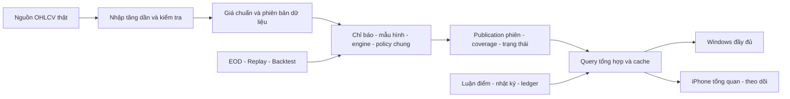

**Phương án chỉnh sửa toàn hệ thống Prot Stock**

Ngày: 02/10/2026. Đây là phương án đề xuất dựa trên đánh giá mã nguồn và kiểm tra cục bộ đã thực hiện; chưa triển khai các thay đổi nghiệp vụ.

**Phạm vi đã chốt theo cách sử dụng của người dùng**

- Windows là nơi dùng đầy đủ: nghiên cứu thị trường/ngành, bộ lọc, phân tích mã, Rules/Core Pack, backtest, danh mục, nhật ký, báo cáo và cài đặt.
- iPhone là nơi xem tổng quan nhanh, xem mã trong Watchlist, đọc lý do đầu tư/theo dõi và ghi nhật ký nhanh.
- Sử dụng cá nhân, không thương mại; tiếp tục là web app; dữ liệu EOD; ưu tiên chi phí dịch vụ bằng0 trong các hạn mức hiện hành.
- Backup, cloud storage dự phòng và quy trình restore được loại khỏi phạm vi phương án này theo yêu cầu mới. Báo cáo đánh giá trước đó vẫn là tài liệu ghi nhận hiện trạng; tài liệu này là phương án áp dụng cho phạm vi mới.

**Quyết định tổng thể**

Giữ React/Vite, Python và PostgreSQL/Supabase cùng GitHub Actions/hosting hiện có. Sửa có chọn lọc theo từng luồng hoàn chỉnh. Chốt hợp đồng dữ liệu và thiết kế luồng UI trước; sửa các kết quả sai và tính toàn vẹn dữ liệu; sau đó tối ưu truy vấn và hoàn thiện hình thức.

Hai thiết bị dùng chung dữ liệu và tài khoản. Khác biệt nằm ở lượng thông tin và thao tác mặc định: Windows đầy đủ, iPhone tập trung ba luồng ngắn. Quyền truy cập không thay đổi chỉ vì kích thước màn hình.

**1. Phương án UI/UX**

**1.1. Cấu trúc điều hướng và màn hình trên Windows**

Sidebar chia nhóm, nhưng không thêm một tầng trang trung gian bắt buộc:

| Nhóm | Chức năng |
|---|---|
| Hằng ngày | Tổng quan, Watchlist, Danh mục, Nhật ký |
| Nghiên cứu | Thị trường & Ngành, Bộ lọc tín hiệu, Phân tích mã |
| Chiến lược | Core Engine/Core Pack, Quy tắc, Kiểm thử lịch sử |
| Hệ thống | Dữ liệu & vận hành, Cài đặt |

Tìm kiếm Ctrl K dùng chung registry route với sidebar. URL giữ mã, khung, ngày và bộ lọc để Back khôi phục đúng ngữ cảnh. Danh sách chức năng trong tìm kiếm phản ánh quyền tài khoản thực tế. Công cụ quản trị đặt trong nhóm hệ thống, tránh mở rộng thêm các tính năng thương mại/đa khách hàng.

| Màn hình | Bố cục và hành vi đề xuất |
|---|---|
| Tổng quan | Đầu trang là phiên dữ liệu, trạng thái công bố và độ phủ. Nội dung chính: rủi ro các mã đang giữ → luận điểm cần xem lại → setup mới → thay đổi Watchlist. Market Health/ngành là bối cảnh; thông tin vận hành chi tiết mở thêm. |
| Thị trường & Ngành | VN-Index, Market Health của universe Prot, sức khỏe ngành và Sector Flow trên cùng trang. Dùng một ngày/khung/kỳ so sánh chung; mỗi chỉ số có phạm vi mẫu và giải thích cách tính. |
| Watchlist | Bảng Tier, mã, giá/ngày EOD, lý do theo dõi ngắn, trạng thái luận điểm, tín hiệu thay đổi, ngày review. Mở panel để đọc/sửa luận điểm và xem bằng chứng. Roulette đặt trong tiện ích thu gọn. |
| Phân tích mã | Chart D/W/M và thanh công cụ gọn; panel luận điểm cá nhân bên cạnh. Nội dung dưới chart theo thứ tự: kết luận engine → trigger/invalidation → mẫu hình/vùng giá → MACD/Flow → chỉ báo và dữ liệu phụ. |
| Bộ lọc tín hiệu | Bộ lọc cơ bản luôn thấy; nâng cao mở thêm. Kết quả gộp theo mã nhưng giữ bằng chứng D/W/M. Bảng có cột chọn được, sort/filter server và pagination. Một lần bấm mở mã; có “Vì sao?” và xuất đúng kết quả lọc. |
| Danh mục | NAV, tiền mặt, P&L thực hiện/chưa thực hiện, vốn nộp/rút và rủi ro; bảng vị thế và ledger giao dịch. Form ghi/sửa giao dịch có tổng tiền/phí trước khi lưu và phản hồi rõ. |
| Nhật ký | Timeline quyết định và review luận điểm; lọc theo mã/ngày/trạng thái. Liên kết luận điểm, tín hiệu tại thời điểm ghi và giao dịch nếu có. Thống kê công khai phạm vi và số mẫu. |
| Core/Rules | Mỗi pack thể hiện vai trò, version, trạng thái và điều kiện; rule editor có nháp, preview các điều kiện hiểu được, dry-run, lịch sử phiên bản và kích hoạt rõ ràng. |
| Backtest | Chọn rule/version/mã/khung/khoảng ngày/chi phí rõ ràng. Hiển thị trạng thái queue, đang chạy, thành công, thất bại; kết quả có assumptions, phiên bản, số trade và dữ liệu đầu vào. |
| Dữ liệu & vận hành | Nguồn thật, lịch bắt đầu EOD, lần chạy gần nhất, độ phủ, mã thiếu, trạng thái sửa dữ liệu, hàng đợi backtest và hạn mức sử dụng. |
| Cài đặt | Sáng/tối/theo hệ thống, mật độ bảng, ưu tiên hiển thị, tài khoản và đăng xuất. Trợ giúp xuất hiện ở chức năng liên quan. |

**1.2. Cấu trúc iPhone**

Ba mục điều hướng chính: **Tổng quan — Theo dõi — Nhật ký**. Menu tài khoản trong header có theme, cài đặt và đăng xuất. Các công cụ khác có thể mở qua “Thêm công cụ”, nhưng không chiếm không gian của luồng sử dụng hằng ngày.

| Luồng | Nội dung |
|---|---|
| Tổng quan nhanh | Phiên nào/đủ dữ liệu chưa; thị trường tích cực/trung tính/phòng thủ; mã đang giữ hoặc theo dõi cần xem lại; thay đổi quan trọng từ lần xem trước. |
| Watchlist nhanh | Thẻ mã: Tier, giá và ngày, một câu lý do theo dõi, trạng thái luận điểm, một rủi ro chính, tín hiệu mới nếu có. Có filter Tier và tìm mã. |
| Mở một mã | Đầu màn hình là luận điểm của người dùng; bên dưới là bằng chứng hệ thống ngắn, điều kiện hành động/vô hiệu và chart nhỏ tải khi cần. Có nút “Ghi nhật ký” đã chọn mã. |
| Nhật ký nhanh | Mã được điền theo ngữ cảnh; một ô nội dung và nhãn Quan sát/Giữ luận điểm/Cần xem lại/Vô hiệu luận điểm. Lưu draft, phản hồi đã lưu server hoặc đang chờ đồng bộ. |

Không tải tất cả bảng/chỉ báo/lịch sử nhiều năm khi mở Tổng quan hoặc Watchlist. Form giao dịch đầy đủ, Rules và backtest nằm trong các luồng chuyên sâu chủ yếu dùng trên Windows.

**1.3. Luận điểm đầu tư kết nối Watchlist — Phân tích — Nhật ký**

Không suy ra “vì sao đầu tư” chỉ từ điểm engine. Mỗi mã có hai vùng rõ:

| Luận điểm cá nhân | Bằng chứng hệ thống |
|---|---|
| Người dùng ghi lý do, kỳ vọng, thời hạn, rủi ro và điều kiện vô hiệu. | Hệ thống cung cấp EOD, xu hướng, mẫu hình, trigger, MACD/Flow và coverage. |
| Có phiên bản, ngày review và lịch sử thay đổi. | Có ngày, khung, publication/data revision và phiên bản thuật toán. |
| Hệ thống có thể đề nghị review khi bối cảnh đổi; người dùng quyết định trạng thái luận điểm. | Điểm cao không tự chứng minh luận điểm đúng và không tự tạo giao dịch. |

Đề xuất thêm `investment_theses` và các phiên bản bất biến gồm user_id, symbol_id, version, lý do ngắn, nội dung dài tùy chọn, điều kiện xem xét hành động, điều kiện vô hiệu, rủi ro/phản biện, mốc review và liên kết evidence tại thời điểm lưu.

Trạng thái luận điểm: nháp, đang theo dõi, cần review, vô hiệu, kết thúc. Nhãn “đang có vị thế” lấy từ danh mục, không trộn vào trạng thái luận điểm. Tier S/A/B vẫn giữ ý nghĩa theo dõi hiện có, độc lập với việc đang nắm giữ hoặc có lệnh mua.

Thêm mã nhanh mặc định TierB. Lý do có thể nhập ngay hoặc bổ sung sau; khi chưa có thì hiện “Chưa ghi luận điểm”, không tự điền bằng câu khẳng định đầu tư. Khi ghi nhật ký từ một mã, giữ symbol, thesis version và snapshot đang xem; ghi chú không tự được tính là giao dịch thắng/thua.

**1.4. Hệ thống thiết kế chung**

| Thành phần | Quy ước đề xuất |
|---|---|
| Font | Font hệ thống: Segoe UI trên Windows, font hệ thống trên iPhone; cùng scale, weight và line-height; số tài chính dùng tabular numerals. Giảm phụ thuộc tải font ngoài. |
| Cỡ chữ | Nội dung Windows14–16px; nội dung/iPhone input16px; nhãn phụ thông thường≥12px; chart labels12–13px. Đây là mục tiêu thiết kế, không phải giới hạn font bắt buộc của WCAG. |
| Khoảng cách | Scale4/8/12/16/24/32px; card padding16–24px; bảng tiêu chuẩn khoảng44px/hàng, tùy chọn mật độ cao cho Windows. |
| Màu | Giữ nhận diện xanh/lime hiện có. Nền và surface ổn định; text/muted/accent/status dùng token semantic; màu được kiểm tra trên hai theme sau dựng. |
| Sáng/tối | Sáng, tối và theo hệ thống; lưu lựa chọn. Không thay đổi màu chart ngoài đồng bộ theme chuẩn. |
| Glass | Dùng hạn chế ở điều hướng/overlay; nội dung số liệu dùng nền đọc rõ. Có fallback nền đặc, tùy chọn giảm hiệu ứng và hỗ trợ tăng tương phản. |
| CTA | Một hành động chính mỗi ngữ cảnh; các tác vụ phụ ở menu/nhóm phụ. Nút icon có tên truy cập và tooltip phù hợp. |
| Motion | Chuyển động ngắn, không bắt buộc để hiểu trạng thái; tôn trọng reduced-motion; trạng thái EOD không tạo cảm giác dữ liệu realtime. |
| Tương tác | Click/Enter cho chi tiết; modal có đóng/Escape, trap/restore focus; giữ draft; Undo phù hợp cho gỡ mã. |
| CSS/component | Hợp nhất tokens và Button/Input/Select/Table/Dialog/Toast/Status/EmptyState. Chuyển dần CSS cũ theo từng trang, tránh thêm một lớp override mới cho toàn bộ hệ thống. |

Apple HIG và Microsoft Fluent được dùng làm định hướng, WCAG2.2AA làm mục tiêu khả năng truy cập web. Kính/blur không được coi là bằng chứng đạt chuẩn native. [Apple Materials](https://developer.apple.com/design/human-interface-guidelines/materials), [Microsoft Design Guidelines](https://learn.microsoft.com/en-us/windows/apps/design/guidelines-overview), [WCAG2.2](https://www.w3.org/TR/WCAG22/).

Các điều kiện nghiệm thu: chữ thường contrast≥4,5:1; chữ lớn≥3:1; thành phần giao diện cần phân biệt đạt contrast phù hợp; zoom200% và reflow320CSSpx; vùng chạm chính iPhone khoảng44×44px; keyboard toàn luồng; screen reader đọc được tên/trạng thái; focus không bị sticky header/bottom bar che. Target size tối thiểu của WCAG2.2AA là24×24CSSpx với ngoại lệ;44px là mục tiêu sử dụng trên điện thoại. [Target Size](https://www.w3.org/WAI/WCAG22/Understanding/target-size-minimum.html).

**1.5. Áp dụng năm tiêu chí UX và năm tiêu chí UI**

| Tiêu chí | Thiết kế cần đạt |
|---|---|
| Usefulness | Tổng quan cho biết việc cần xem; Watchlist có luận điểm; nhật ký review nối với quyết định và trade thực. |
| Usability | Một lần bấm mở mã; ghi nhanh ít trường; không dùng lựa chọn ngầm; bỏ nút không hoạt động. |
| Findability & Accessibility | Navigation/tìm kiếm chung, URL giữ ngữ cảnh, labels và keyboard/zoom/focus đúng. |
| Credibility | Ngày/nguồn/coverage/version đúng; tách quan điểm cá nhân khỏi dữ liệu; không gọi template tĩnh là AI. |
| Desirability | Giao diện dễ đọc lâu, ít nhiễu, thao tác có phản hồi và giữ nội dung khi lỗi. |
| Consistency | Chung token/component/nhãn/route/trạng thái; cùng chỉ số có cùng định nghĩa ở mọi trang. |
| Visual Hierarchy | Hành động và rủi ro cá nhân đứng trước chi tiết kỹ thuật/vận hành. |
| Color & Contrast | Màu có nghĩa semantic, đi kèm chữ/icon, kiểm hai theme. |
| Whitespace | Spacing scale chung; bảng đủ compact cho Windows, thẻ ngắn dễ đọc trên iPhone. |
| Feedback | Loading/error/empty/stale khác nhau; pending/success/failure rõ; Retry/Undo/draft phù hợp. |

**1.6. Áp dụng đủ mười nguyên tắc Nielsen**

| Nguyên tắc | Thay đổi và điều kiện chấp nhận |
|---|---|
|1. Hiển thị trạng thái | Mọi khu vực phân biệt chưa kết nối/đang tải/rỗng/lỗi/cũ/thiếu/đủ.0/0 không được kết luận đã đủ độ phủ. |
|2. Ngôn ngữ thực tế | Nội dung chính tiếng Việt; action/reason kỹ thuật nằm trong chi tiết; ngày và giờ Việt Nam. |
|3. Kiểm soát và tự do | Mobile có đăng xuất; dialog có đóng/Escape; draft không mất khi đóng ngoài ý muốn; gỡ mã có Undo. |
|4. Nhất quán | Một route registry và glossary; tên chức năng không đổi nghĩa giữa thiết bị. |
|5. Phòng ngừa lỗi | Chọn rule/ngày rõ; parser báo điều kiện chưa hiểu; chặn gửi lặp; server chống lặp request. |
|6. Nhận biết thay vì nhớ | Mỗi mã có lý do, rủi ro, trigger/invalidation, ngày review và “Vì sao?” dễ tìm. |
|7. Hiệu quả và linh hoạt | Windows có shortcut/saved filters/mật độ bảng; iPhone có ba luồng ngắn; chi tiết tải theo nhu cầu. |
|8. Thẩm mỹ và tối giản | Mặc định chỉ nội dung giúp nghiên cứu/quyết định; kỹ thuật và tiện ích mở thêm. |
|9. Phục hồi lỗi | Thông báo tác động + việc có thể làm; giữ nội dung nhập; lỗi không biến thành không có tín hiệu. |
|10. Trợ giúp | Giải thích ngay cạnh chỉ số; hướng dẫn/lịch/số mã lấy từ cấu hình/dữ liệu hiện tại. |

Khung tham chiếu: [Nielsen Heuristics](https://www.nngroup.com/articles/ten-usability-heuristics/).

**2. Phương án logic và schema cho toàn bộ phân hệ**

**2.1. Hợp đồng dữ liệu chung**

Mỗi kết quả cần định nghĩa rõ symbol, timeframe, as_of_date, collected/calculated/published_at, nguồn, đơn vị, chế độ raw/adjusted, data_revision, engine/algorithm_version, rule_version/hash, publication_id và coverage. Không nhất thiết thêm tất cả trường lặp vào mọi bảng; có thể tham chiếu run/publication manifest chung.

- Giữ quy ước giá nghìnVND trong lịch sử đang có để giảm phạm vi migration. Mọi tính tiền/quantity chuyển đơn vị qua hàm chuẩn; vốn, phí và ledger là VND. UI ghi đúng đơn vị đang hiển thị.
- Ngày giao dịch và kỳ D/W/M theo lịch Việt Nam; timestamps lưu UTC và hiển thị Việt Nam. Không lấy ngày UTC làm ngày ghi nhật ký ở ranh giới ngày Việt Nam.
- Nến chưa đóng không tạo quyết định EOD; thiếu dữ liệu là UNKNOWN, không phải0 hoặc điều kiện FAIL mặc định.
- JSON schema/DTO có version và fixtures dùng chung cho Python/TypeScript. Frontend không tự định nghĩa lại phương pháp tính quyết định.
- Cùng publication và input phải cho cùng nhận định. Các ý nghĩa “mã”, “tín hiệu”, “khung”, “đồng thuận” không dùng thay nhau trong thống kê.

**2.2. Thiết kế theo từng module**

| Module | Phương án chỉnh sửa | Điều kiện nghiệm thu |
|---|---|---|
| Schema | Giữ bảng lõi, keys/FK/CHECK/index/RLS. Migrations bổ sung; rule versions append-only; run/publication metadata; operation ID và transactions; thêm luận điểm có version và lịch sử membership khi cần. | Không sửa version đã dùng; không trùng khi rerun; không mất ledger/nhật ký khi mã chuyển inactive; quyền owner được giữ. |
| Mẫu hình | Registry detector có version, required history, FORMING/READY/CONFIRMED/INVALIDATED/EXPIRED, trigger/invalidation/expiry, confirmation date và quality components. Tách hình học khỏi hành động giao dịch. | Pivot chưa xác nhận không được dùng sớm; pattern hỏng/hết hạn không sinh entry; cùng cấu trúc không đếm lặp; điểm cấu trúc không gọi xác suất thắng. |
| Core Engine | Một dispatcher chung từ bars đóng → indicators/context → đề xuất engine → shared policy → resolver. Tách market observations khỏi portfolio-specific actions. | EOD/replay/backtest cùng evaluator và cùng action với cùng input/context; dữ liệu thiếu không thành mua; không sửa lịch sử thị trường theo vị thế hiện tại. |
| Core Pack | Khai báo rõ vai trò setup/confirmation/context/risk gate; active config có revision; confluence dedup theo evidence cluster. | Pack context không tự bỏ phiếu mua; gate/veto có lý do; bật/tắt tạo revision hoặc version cấu hình được tham chiếu. |
| Rules | Một parser/schema; whitelist; báo phần chưa hiểu; DRAFT→preview/dry-run→ACTIVE; tách entry/exit/risk; stop phần trăm lấy từ vị thế. | Không âm thầm bỏ ROE hoặc điều kiện lạ; WATCH không mua; DSL sai loại/rỗng bị từ chối; sửa tạo version/hash mới. |
| MACD | Thống nhất EMA seed/warm-up/cutoff/nến đóng. Backend làm nguồn quyết định; series chart từ backend hoặc TS có parity fixtures. | Cùng bars cho số giống trong sai số khai báo; đổi vùng chart không đổi tín hiệu; phân kỳ/giao cắt không xuất hiện trước thời điểm xác nhận. |
| Market Health | Mẫu số hợp lệ cho từng thành phần; UNKNOWN/coverage rõ; version công thức; phân biệt VN-Index với health của tập mã Prot. | Thiếu SMA200 không bị coi dưới SMA200; điểm trên tập quan sát không che dữ liệu thiếu; không nâng thành trạng thái đủ/cho entry khi thiếu điều kiện coverage đã định nghĩa. |
| Prot Flow | Giữ proxy OHLCV, tách điểm nhiều phiên và trạng thái nến; required history theo từng thành phần; nhãn “áp lực giá–khối lượng”. | Thiếu lịch sử thì không tính như0; điểm và màu giải thích được; không gọi là tiền tổ chức/net inflow hoặc tự tạo lệnh. |
| Sức khỏe ngành | Sample floor/coverage và phân bố mạnh/yếu; membership tại ngày xem; nếu lịch sử chưa đủ thì công khai tập mã hiện tại. | Ngành quá ít mẫu có nhãn riêng; thay ngành không âm thầm đổi lịch sử; xếp hạng có cỡ mẫu và kỳ. |
| Sector Flow | Median flow, số mã tích cực/tiêu cực và turnover share là các chỉ số riêng. Thống nhất kỳ và coverage. | Median không gọi tổng dòng tiền; share không gọi tiền vào ròng; mọi số có đơn vị/ngày/phạm vi. |
| Bộ lọc tín hiệu | Server filter/sort/pagination; group by symbol có evidence D/W/M; thay đổi so với phiên trước; điều kiện action/trigger/stop rõ. | Không bỏ tín hiệu vì page cap; filter trên UI và export cùng semantics; nhiều khung trái chiều không bị che. |
| Phân tích mã | Luận điểm và evidence đi cùng; chart chính độc lập dữ liệu phụ; tải thêm theo nhu cầu; ngày/khung/publication nhất quán. | Lỗi fundamentals/disclosures không làm chart giá biến mất; thiếu phần nào báo phần đó; từ Watchlist mở đúng mã/thesis. |
| Danh mục | Ledger là nguồn chuẩn; atomic RPC cho capital/trade; request ID chống lặp; replay hoặc daily NAV; tách cash/contributions/P&L/fees. | Nộp/rút không tính thành lợi nhuận; mua/bán hôm nay không thay đồ thị trước ngày giao dịch; retry không nhân đôi. |
| Nhật ký | Entry gắn thesis version và evidence tại ngày quyết định; review/link trade/outcome riêng; immutable context; sửa note có lịch sử phù hợp. | Không dùng tín hiệu hôm nay để phán quyết entry cũ; D/W/M không collapse theo thứ tự dòng ngẫu nhiên; ghi chú không thành trade win/loss. |
| Watchlist | Tier/order giữ ổn định; cloud là trạng thái đã xác nhận; outbox bền theo user và operation ID; reconcile có version; luận điểm đọc nhanh. | Reload/mạng lỗi không mất pending edit; hai thiết bị không ghi đè im lặng; gỡ không xóa luận điểm/nhật ký lịch sử. |
| Backtest | Cùng engine/policy; event order đúng; đơn vị tiền đúng; warm-up; rules/patterns/exit; assumptions/timeframe/data version khóa. | Các repro lỗi hiện tại thành regression tests; cash/quantity/NAV đúng từng ngày; không mua WATCH; kết quả có thể tái lập. |
| Kiểm thử | Business invariants, parity, prefix/as-of, data failure/retry, ledger và luồng UI trọng yếu. Fixtures/golden results versioned. | Tests kiểm tra giá trị đúng và trình tự thời gian; thêm dữ liệu tương lai không làm sai snapshot as-ofT; không chỉ kiểm tên metrics. |
| Cài đặt | Cấu hình cá nhân đúng vai trò; lịch/nguồn/threshold versioned; lựa chọn theme/mật độ; tài khoản và logout. | Đổi option có hiệu lực rõ; tài liệu lấy cấu hình thật; không mở thêm phân hệ thương mại. |
| Dashboard | Đọc publication thống nhất và personal summaries; ưu tiên rủi ro/luận điểm cần review; action/await/context rõ. | Cùng ngày/revision với chi tiết; error khác empty; mobile có thể tìm mã cần xem và lý do trong một luồng ngắn. |

**2.3. Backtest cần sửa trước khi dùng so sánh chiến lược**

1. Thay evaluator tổng quát bằng dispatcher đúng loại DSL; từ chối Core DSL sai cấu trúc thay vì `all([])=True`.
2. Cấp patterns và context đúng as-of; xử lý WATCH/entry/REDUCE/EXIT theo vị thế và policy. Không xem mọi điều kiện pass là lệnh mua.
3. Tách closeT đánh giá → pending order → openT+1 khớp → closeT+1 định giá. Lệnh tương lai không thay equityT.
4. Chuẩn hóa nghìnVND→VND khi tính quantity/cash/fees; lot size và rounding là assumptions công khai.
5. Warm-up trước date_from đủ cho các indicators/detectors; trade chỉ trong kỳ; W/M chỉ nến đóng; annualization theo tần suất/phương pháp đã chốt.
6. Công khai stop EOD-next-open và hạn chế dữ liệu OHLC. Nếu thêm intrabar sau này phải có phương pháp/assumptions riêng, không ngầm coi EOD là khớp intraday chính xác.
7. Khóa DSL/hash/config/assumptions/input manifest. Fingerprint phát hiện dữ liệu sửa nhưng không tự đủ để tái tạo: cần giữ revision hoặc input dataset của lần chạy trong phạm vi ngân sách dung lượng.
8. Worker claim job có lease/timeout, enqueue kiểm error, chặn gửi lặp; trạng thái và kết quả không bị sửa theo rule active mới.

Giữ ngưỡng/trọng số hiện có làm cấu hình ban đầu có version. Chỉ hiệu chỉnh sau khi tính toán đã đúng và có nghiên cứu theo pattern/khung/ngoài mẫu; không diễn giải điểm heuristic thành tỷ lệ thắng.

**3. Phương án lấy dữ liệu, EOD, thống kê và hiệu năng**

**3.1. Luồng dữ liệu mục tiêu**

Các màn hình đọc một publication_id/date/revision chung. Kết quả sửa hoặc công bố mới có revision riêng; một phần dữ liệu chưa hoàn tất không bị trình bày như phiên đã đầy đủ.

**3.2. Lấy dữ liệu và chạy hàng ngày**

| Việc sửa | Thiết kế đề xuất |
|---|---|
| Provider thật | KBS/VCI phải là adapter/endpoint độc lập đã kiểm chứng. Nếu chưa có adapter dự phòng hợp lệ thì tên nguồn phải phản ánh KBS thật. Không ghi VCI cho dữ liệu KBS. |
| Manifest universe | Lấy danh sách active và membership hiệu lực; ghi expected symbols/count/hash. Chia shard động cân bằng; không hard-code104+phần còn lại hoặc cap tổng số mã. |
| Incremental | Lấy từ mốc đã có với overlap nhỏ cấu hình để bắt sửa dữ liệu gần đây; chỉ rebuild các kỳ/phụ thuộc bị ảnh hưởng. Sự kiện điều chỉnh hoặc sửa lịch sử lớn có luồng riêng. |
| Kiểm chất lượng | OHLC hợp lệ, đơn vị, duplicate, ngày phiên, volume/trạng thái giao dịch, source provenance và lịch sử cần thiết. Raw/adjusted ghi đúng chế độ thật. |
| Retry |429/5xx/timeout có backoff+jitter và số lần giới hạn; retry đúng mã thiếu; idempotent writes; không tăng concurrency dồn nguồn miễn phí. |
| Lock/heartbeat | Ingest/rebuild/repair không ghi chồng cùng phạm vi; heartbeat/lease và timeout cho RUNNING treo. |
| Tái sử dụng | Indicators/pattern/context tính một lần trong một run khi input/version không đổi; finalize dùng kết quả đó; W/M chỉ ghi period thay đổi và phụ thuộc. |
| Publication | Tính xong breadth/sector/signals rồi chuyển pointer publication; publication rõ COMPLETE/PARTIAL/FAILED. Coverage đủ theo contract mới báo đủ. |
| Mã thiếu | Giữ latest usable data có ngày rõ; không gắn dữ liệu cũ là hôm nay; action policy dùng trạng thái missing/stale đã định nghĩa. |
| Lịch | Một cấu hình cho giờ bắt đầu, watchdog và UI. Giữ lịch hiện có làm baseline đến khi đo độ sẵn sàng upstream; hướng dẫn không quảng bá các lượt retry không tồn tại. |
| Queue backtest | Worker chạy nhẹ theo lịch hoặc sau EOD phù hợp quota; claim/lease/error/timeout; không để QUEUED chờ vô hạn. |

File CSV hiện265mã, chưa phải số active production đã xác minh. Shards hiện104+161 nếu DB có cùng265mã; chưa bỏ mã nhưng mất cân bằng.17,4phút là riêng phần pause6,5giây×161, chưa tính mạng và phân tích. Mục tiêu tốc độ đến từ giảm công việc lặp, query nhỏ và chia lô hợp lý.

Đối với corporate actions: kiểm tra vài trường hợp thật; định nghĩa raw/adjusted áp dụng cho chart, indicators và backtest. Không tự khẳng định giá đã điều chỉnh chỉ vì schema có cột adjusted_close.

**3.3. Query, cache và payload**

- Filter/sort/aggregate chạy ở PostgreSQL theo symbol/date/timeframe/action/score/publication và owner; bảng chi tiết phân trang có thứ tự ổn định cùng tie-breakerid.
- `.limit(3000/5000)` không thay thế pagination khi API cap thấp hơn. Mọi query có thể lớn phải phân trang hoặc aggregate đúng; kiểm bằng dữ liệu vượt1000giao dịch/5000tín hiệu.
- Sparkline lấy số phiên cần thiết cho từng mã bằng query/RPC phù hợp, không lấy limit toàn bảng rồi chia trên client.
- Chart đầu tiên tải300–500nến hoặc lượng đủ hiển thị; lịch sử sâu tải thêm. Dữ liệu tính toán engine vẫn giữ lookback theo contract riêng.
- Shared publication query; cache EOD theo publication/symbol/frame/revision; danh sách mã cache dài; polling nhanh chỉ khi đang có job, ngoài ra refresh theo publication/mở trang/manual.
- Các query cá nhân gắn user_id; khi đổi phiên cancel/xóa cache hiển thị cá nhân. Draft/outbox chỉ đọc trong namespace đúng user, không làm mất pending write trước khi server xác nhận.
- iPhone dùng summary payload theo danh sách đang theo dõi; chart/thư viện export không tải trong luồng Tổng quan/Watchlist.
- Tải PDF/XLSX/chart libraries khi thật sự cần; tách CSS theo component/page; font hệ thống giảm request ngoài.
- Service worker chỉ fallback HTML cho navigation; API lỗi trả trạng thái đúng. Offline draft/outbox là bảo vệ thao tác ngắn, không mở rộng thành offline app đầy đủ.
- Đo EXPLAIN ANALYZE/query plans/table+index sizes trước khi thêm index; tránh index trùng và tăng chi phí ghi/dung lượng.

**3.4. Báo cáo, thống kê và bảo toàn lịch sử**

| Báo cáo | Quy ước |
|---|---|
| NAV/P&L | Cash và số lượng đúng từng ngày; nộp/rút là dòng vốn; fees/tax tách rõ; TWR nếu dùng phải có công thức và phương pháp định giá đúng. |
| Nhật ký | Thống kê quyết định/review riêng với trade outcome; win rate chỉ có khi outcome thực, đủ sample và phạm vi ghi rõ. |
| Tín hiệu | Phân biệt số mã, số tín hiệu, số khung; phiên, coverage, filters và algorithm version. |
| Thị trường/ngành | Mẫu quan sát, membership/cách xây lịch sử, số mã và kỳ; UNKNOWN/thiếu dữ liệu có nhãn. |
| Backtest | Assumptions, rule/config/data versions, tần suất, số trade, phạm vi và benchmark cùng kỳ. |
| Export | CSV/XLSX/PDF dùng cùng query semantics với UI; ghi as-of/publication, đơn vị, filter và số dòng; xuất trang hiện tại khác xuất toàn bộ kết quả. |

Thống kê tổng tính trên toàn tập hợp lệ ở server, không dựa vào100journal hoặc1000transactions tải về. Mã ra khỏi universe chuyển inactive cùng ngày hiệu lực; giữ ledger, nhật ký, luận điểm, quyết định và kết quả đã tham chiếu. Migrations bổ sung và chuyển đổi có kiểm tra; không dùng purge lịch sử cá nhân như quy trình loại mã mặc định.

Dữ liệu cache/geometry trung gian có chính sách dung lượng riêng; không tự xóa dữ liệu cá nhân để giảm DBsize. Giá gốc, input cần tái lập và evidence đã gắn quyết định phải có phạm vi giữ phù hợp. Chốt retention sau khi đo kích thước và yêu cầu backtest, không cắt lịch sử tùy tiện.

**4. Thứ tự frontend/backend, triển khai và chi phí**

**4.1. Thứ tự triển khai một phương án thống nhất**

| Đợt | Phạm vi | Frontend làm cùng | Điều kiện hoàn tất |
|---|---|---|---|
|1. Chốt contract và thiết kế luồng | Từ điển đơn vị/ngày/trạng thái/vai trò pack; schema bổ sung cho version/luận điểm/publication; tái hiện các lỗi hiện tại | Wireframe Windows và ba luồng iPhone trên dữ liệu mẫu; chuẩn labels/status; bỏ AI template/nút giả, zoom/logout | Mỗi chỉ số/hành động có định nghĩa; các luồng và payload được xác định; lỗi có ca kiểm tra rõ. |
|2. Sửa độ đúng trọng yếu | Backtest dispatcher/units/equity/warm-up; Rules append-only/parser/risk; capital/trade atomic; NAV/nhật ký đúng thời điểm; cache/outbox cá nhân | Enqueue/lưu phản hồi rõ; trạng thái dữ liệu và cảnh báo phạm vi; không trình bày kết quả chưa đúng như đã kiểm chứng | Regression và parity tests đạt; ledger đối chiếu; pending edit không mất khi reload; version cũ không bị ghi đè. |
|3. Chuẩn hóa phân tích và EOD | Pattern/Core/Pack/MACD/Health/Flow/sectors; provider/manifest/retry/heartbeat/publication/worker | Các trang đọc publication chung; ngày/coverage/unknown đúng | Cùng input/context cho cùng action; thiếu mã không báo đủ; jobs có đường hoàn tất hoặc lỗi rõ. |
|4. Tối ưu data và báo cáo | Server pagination/aggregate, cache revision, batch, tránh tính/ghi lặp, query/index theo số đo | Summary mobile, chart/export tải khi cần; phạm vi báo cáo/filter khớp | Không cắt thống kê; request/bytes/latency/EOD đo trước/sau; UI/export khớp. |
|5. Hoàn thiện màn hình | Nối Watchlist–thesis–analysis–journal; layout/components/tokens | Windows đầy đủ; iPhone tổng quan/theo dõi/nhật ký; keyboard/dialog/contrast/motion | Hoàn thành các tác vụ trọng yếu trên thiết bị mục tiêu; hai theme/dữ liệu đầy đủ không phá layout. |
|6. Nghiệm thu tổng thể | Fixtures, integration/migration checks, lỗi mạng/retry/queue và dữ liệu production cần xác minh | Thử hành trình cá nhân thật, Windows browser và Safari iPhone; đo tốc độ | Điều kiện đúng dữ liệu, UX, performance và quota đều có bằng chứng. |

Thiết kế UI bắt đầu cùng đợt1; đóng hình thức UI sau khi contract và số liệu ổn định. Backend đi trước ở phần tính toán/toàn vẹn; frontend cập nhật ngay theo từng luồng. Đây là một phương án đầy đủ chia đợt thực hiện, không phải nhiều phương án để người dùng chọn lại.

**4.2. Công cụ và ngân sách miễn phí**

| Thành phần | Lựa chọn |
|---|---|
| Web | React/Vite hiện có; responsive Windows/iPhone |
| Phân tích | Python batch hiện có; deterministic explanations |
| Database/Auth | PostgreSQL/Supabase hiện có; owner RLS |
| Jobs | GitHub Actions Linux, cache dependencies và giảm tính lặp |
| Hosting | Hosting cá nhân hiện có, free subdomain |
| Chart/export | Thư viện hiện có, tải khi cần |

Không thêm native app, dịch vụ AI trả phí, realtime market subscription, Redis hoặc microservices vào lộ trình.

Supabase Free hiện có500MB database,5GB egress thông thường và các quota khác; GitHub Free với repo private có2.000phút/tháng và500MB artifacts theo tài liệu hiện hành; Vercel Hobby dành cho personal/non-commercial. Theo dõi usage, giữ ngân sách dự kiến dưới quota và không tự bật dịch vụ trả phí. [Supabase Pricing](https://supabase.com/pricing), [GitHub Actions Billing](https://docs.github.com/en/billing/concepts/product-billing/github-actions), [Vercel Hobby](https://vercel.com/docs/plans/hobby).

Chi phí dịch vụ mục tiêu bằng0 trong hạn mức hiện hành. Với dữ liệu lịch sử tăng, cần đo database/index/egress/minutes và điều chỉnh payload, computation, cache trung gian; không hứa hạn mức miễn phí đáp ứng mọi quy mô.

**4.3. Bộ tiêu chí nghiệm thu**

| Nhóm | Điều kiện |
|---|---|
| Độ đúng | Các lỗi backtest đã tái hiện đều được khóa bằng tests; tiền/quantity/NAV đúng; same input+version cho same action; rule/thesis version bất biến. |
| Thời điểm | Nến tương lai không ảnh hưởng snapshot quá khứ; closedT và fillT+1 tách đúng; nhật ký giữ đúng evidence đã xem. |
| Dữ liệu | Rerun không tạo bản trùng; thiếu/partial/stale không bị gọi complete; nguồn/đơn vị/membership đúng. |
| Ghi cá nhân | Retry không nhân đôi; lỗi giữa thao tác không tạo ledger lệch; draft/outbox không mất trong các ca reload/mất mạng đã kiểm; không hiển thị cache user khác. |
| Báo cáo | Tổng UI và export khớp cùng filter/publication; thử dữ liệu vượt API cap; ghi rõ sample/phạm vi. |
| Windows | Mục tiêu ban đầu nội dung chính p95≤2giây trong điều kiện mạng/máy kiểm thử xác định; thao tác nghiên cứu bằng bàn phím và bảng đầy đủ. |
| iPhone | Mục tiêu tổng quan/watchlist p95≤3giây trong điều kiện kiểm thử xác định; mở đúng luận điểm và ghi note ít thao tác; phản hồi nhập/lưu ngay, trạng thái đồng bộ rõ. |
| EOD | Mục tiêu ban đầu≤30phút từ job bắt đầu tới publication với tập mã và upstream bình thường đã đo; nếu upstream chậm thì trạng thái/coverage phản ánh đúng. |
| Accessibility | Contrast, labels, focus, keyboard, zoom/reflow, vùng chạm và reduced motion trên các luồng trọng yếu. |
| Chi phí | Đo DB+index sizes/egress/Actions minutes; cảnh báo sớm theo ngân sách; không mở dịch vụ trả phí. |

Các mốc tốc độ là mục tiêu cần đo, chưa phải kết quả đạt. Baseline cần ghi cùng điều kiện và tách cold/warm. Kiểm tra thực tế những điểm chưa rõ: migrations/cron đã deployed, active universe, API cap, dữ liệu điều chỉnh, query plans, quota và upstream latency.

**Kết quả sản phẩm mong muốn**

Windows trở thành bàn làm việc nghiên cứu đầy đủ, với số liệu đúng và công cụ dễ tìm. iPhone trả lời nhanh “mã nào cần xem, vì sao tôi theo dõi và hôm nay có gì thay đổi”, rồi lưu được suy nghĩ tại đúng thời điểm. Toàn bộ phân tích, báo cáo và giao diện dùng chung định nghĩa, phiên bản và trạng thái dữ liệu.
